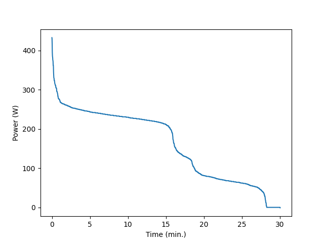

# Programmier-bung2
Namen: Lena Kurzthaler und Ellena Hehle
## Aufgabe 1
Zuerst wurde ein Repository auf Github erstellt und 2 Accounts verknüpft durch das Projekt. Zunächst wurde der Explorer geöffnet, auf dem das Repository mittels Gitbash in das C-Laufwerk geklont wurde (nicht auf Onedrive!). Dann wurde VSC geöffnet und das Projekt geladen. Dafür wurden alle Bibliotheken zur Verwendung heruntergeladen (Matplotlib, Numpy). Anschließend wurde pdm heruntergeladen. 
Auf dem Skriptum befand sich ein Link zu Julian Huber's Repository, welches auf gleiche Weise heruntergeladen wurde, um die Daten, die für die Erledigung der Aufgabenstellung, benötigt wurden (activity.csv und load_data.py).
Auf VSC wurden die Module power_curve.py und sort.py (für den Bubble-Sort Algorithmus) erstellt. Der Bubble-Sort sortiert die Daten power_W und gibt diese von groß nach klein aus. Die sortierten Daten wurden anschließend mithilfe von Matplotlib in einem Liniendiagramm dargestellt (Achsen wurden beschriftet und angepasst). Dieses .png wurde im Explorer abgespeichert (im Anhang befindet sich das Bild_1). 

Anhang: 
Bild_1

